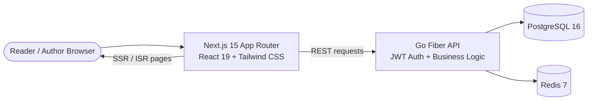

<h1 align="center">AethaReads</h1>

<p align="center">
    A bilingual web novel platform for reading, writing, and building community around serialized fiction.
</p>

<p align="center">
    
    
    
    
    
    
    
</p>

<p align="center">
    <a href="#quick-start">Quick Start</a> ·
    <a href="#features">Features</a> ·
    <a href="#architecture">Architecture</a> ·
    <a href="#api-reference">API</a> ·
    <a href="#testing">Testing</a> ·
    <a href="#project-structure">Structure</a>
</p>

---

## Quick Start

> **Prerequisites:** Docker Desktop recommended, or Go 1.25+, Node.js 20+, PostgreSQL 16+, and Redis 7+

```bash
git clone https://github.com/MadhushanAndawaththa/AethaReads.git
cd AethaReads
```

**Docker Compose**
```bash
docker compose up --build
```

| Service | URL |
|---------|-----|
| Frontend | http://localhost:3001 |
| Backend API | http://localhost:8080/api/health |
| PostgreSQL | localhost:5433 |
| Redis | localhost:6379 |

Open **http://localhost:3001** to browse novels, read chapters, or sign in as an author.

### Manual Setup

**Backend**
```bash
cd backend
cp .env.example .env
go mod tidy
go run ./cmd/server
```

**Frontend**
```bash
cd frontend
npm install
npm run dev
```

---

## Features

| | Feature | Details |
|-|---------|---------|
| 📚 | **Reader-First Chapter Experience** | Adjustable typography, theme switching, responsive reading layout, and fast chapter navigation |
| 🌏 | **Bilingual Reading** | Sinhala, English, and bilingual novel metadata with in-reader translation support |
| 🧭 | **Discovery & Browse** | Search, genre filtering, language filtering, sorting, pagination, and public novel landing pages |
| ✍️ | **Creator Studio** | Dedicated author workspace for managing novels, chapters, metadata, and public profiles |
| 👤 | **Public Author Profiles** | Brand color, social links, published works, and author identity pages under `/user/[username]` |
| 💬 | **Community Layer** | Reviews, ratings, follows, chapter comments, notifications, and reading progress |
| 🔐 | **Secure Auth Flow** | JWT cookie auth, silent token refresh, Google OAuth, and protected author routes |
| 🛡️ | **Content Safety** | DOMPurify sanitization for chapter content and translated HTML before rendering |
| ⚡ | **Performance-Oriented Backend** | Fiber API, Redis-backed catalog caching, migration fallback logic, and Dockerized local stack |
| 📱 | **Mobile-First UX** | Bottom navigation, touch-friendly controls, responsive cards, and optimized reader UI |

---

## Architecture



**Request flow:**

1. **Render** — Next.js serves landing, browse, novel, dashboard, and reader routes using App Router patterns.
2. **Fetch** — frontend server components and client modules call the Go Fiber API.
3. **Resolve** — the backend reads from PostgreSQL, checks Redis for hot-path catalog data, and applies auth/role rules.
4. **Respond** — Next.js renders SEO-friendly pages while client components manage reader settings, comments, follows, and dashboard actions.
5. **Persist** — reading progress, reviews, follows, profile changes, and author content updates are stored through repository-backed handlers.

### Tech Stack

| Layer | Technology |
|-------|-----------|
| **Frontend** | Next.js 15 · React 19 · TypeScript · Tailwind CSS |
| **Backend** | Go 1.25 · Fiber v2 · sqlx |
| **Database** | PostgreSQL 16 |
| **Cache** | Redis 7 |
| **Auth** | JWT cookies · refresh tokens · Google OAuth |
| **Testing** | Vitest · Playwright · Go tests |
| **Dev Environment** | Docker Compose |

### Design Priorities

- **Fast reading experience** — reader UX stays lightweight even as community features expand.
- **Bilingual differentiation** — Sinhala and English content are first-class, not bolted on later.
- **Creator workflows** — authors have a dedicated dashboard instead of being treated as an admin edge case.
- **SEO-friendly discovery** — novel and chapter routes expose metadata and structured data for crawlable public pages.
- **Production-minded foundations** — Redis caching, secure cookie auth, scoped rate limiting, and Dockerized services are already in place.

---

## API Reference

### Public Endpoints

| Method | Endpoint | Description |
|--------|----------|-------------|
| `GET` | `/api/health` | Health check |
| `GET` | `/api/novels` | Paginated novel catalog |
| `GET` | `/api/novels/:slug` | Novel detail with chapter list |
| `GET` | `/api/novels/:slug/chapters/:number` | Chapter content |
| `GET` | `/api/search?q=` | Search novels |
| `GET` | `/api/genres` | List all genres |
| `GET` | `/api/users/:username` | Public author profile |

### Authenticated Endpoints

| Method | Endpoint | Description |
|--------|----------|-------------|
| `POST` | `/api/auth/register` | Create account |
| `POST` | `/api/auth/login` | Login and issue cookies |
| `POST` | `/api/auth/refresh` | Refresh access token |
| `POST` | `/api/auth/logout` | Revoke session |
| `GET` | `/api/auth/me` | Current authenticated user |
| `GET` | `/api/user/profile` | Current user profile |
| `PUT` | `/api/user/profile` | Update reader/author profile |
| `POST` | `/api/author/become` | Upgrade account to author |
| `GET` | `/api/author/novels` | List authored novels |
| `GET` | `/api/author/novels/:id` | Fetch one authored novel |
| `POST` | `/api/author/novels` | Create novel |
| `PUT` | `/api/author/novels/:id` | Update novel metadata |
| `DELETE` | `/api/author/novels/:id` | Delete novel |
| `POST` | `/api/author/novels/:id/chapters` | Create chapter |
| `PUT` | `/api/author/chapters/:id` | Update chapter |
| `DELETE` | `/api/author/chapters/:id` | Delete chapter |

### Catalog Query Parameters

| Param | Default | Options |
|-------|---------|---------|
| `page` | `1` | Positive integer |
| `per_page` | `20` | `1-50` |
| `sort` | `updated` | `updated`, `popular`, `rating`, `title`, `newest` |
| `status` | `all` | `all`, `ongoing`, `completed` |
| `genre` | — | Genre slug |
| `language` | — | `en`, `si`, `bilingual` |

---

## Testing

### Backend

```bash
cd backend
go test ./...
```

Backend coverage includes router-level security behavior, repository-backed handlers, and the evolving Fiber API surface.

### Frontend

```bash
cd frontend
npm run test:unit
```

### End-to-End

```bash
cd frontend
npm run test:e2e
```

Playwright flows cover core reader and author scenarios, including author signup flow, Sinhala novel publishing, multilingual browse, translation safety, and community/library interactions.

---

## Project Structure

```text
AethaReads/
├── backend/
│   ├── cmd/server/main.go
│   ├── internal/
│   │   ├── cache/          # Redis-backed cache helpers
│   │   ├── config/         # Environment configuration
│   │   ├── database/       # Postgres, Redis, migrations, seed logic
│   │   ├── handlers/       # HTTP handlers
│   │   ├── middleware/     # JWT and request middleware
│   │   ├── models/         # Domain models and request payloads
│   │   ├── repository/     # SQL access layer
│   │   └── router/         # Route setup and HTTP middleware
│   ├── migrations/
│   └── Dockerfile
├── frontend/
│   ├── src/
│   │   ├── app/            # App Router pages and layouts
│   │   ├── components/     # Reader, browse, dashboard, and auth UI
│   │   └── lib/            # API client, security helpers, types, utilities
│   ├── tests/e2e/          # Playwright specs
│   └── package.json
├── docker-compose.yml
├── roadmap_v3.md
└── roadmap_v5.md
```

---

## Development Notes

- Frontend container runs on **3001** externally and talks to the backend service over the Docker network.
- Backend container runs database migrations on startup and includes migration fallback logic for local/dev consistency.
- Reader translations are sanitized before rendering, so translated HTML follows the same safety path as authored content.
- Author tooling, reader UX, and platform hardening are being tracked in the project roadmap files rather than mixed into the README.

---

## License

MIT © 2026 Madhushan Andawaththa
